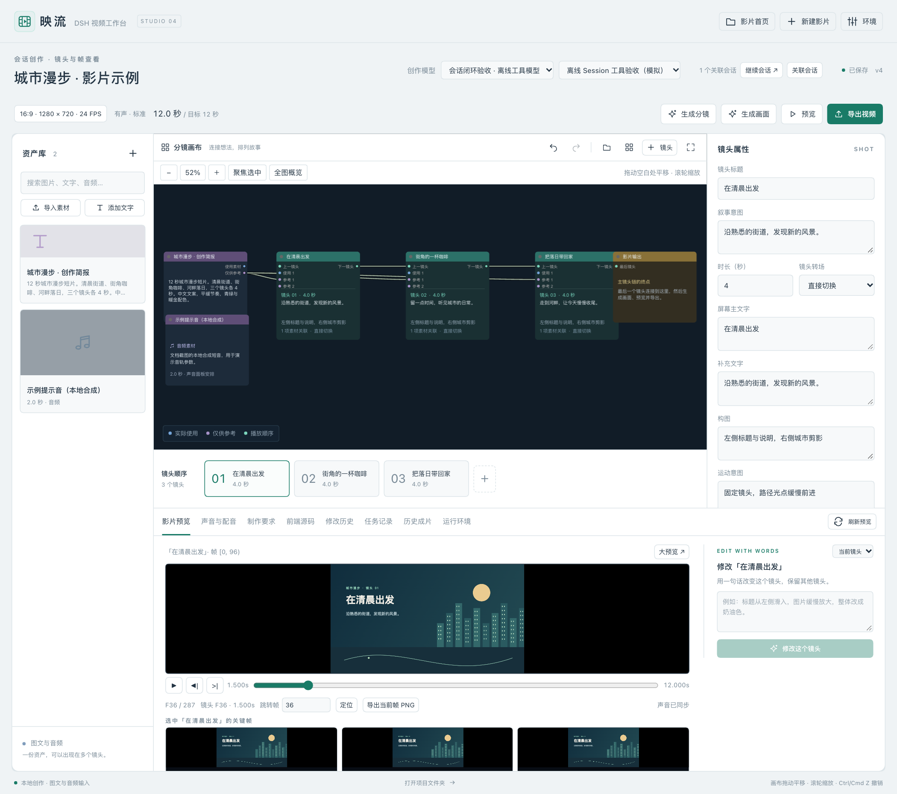
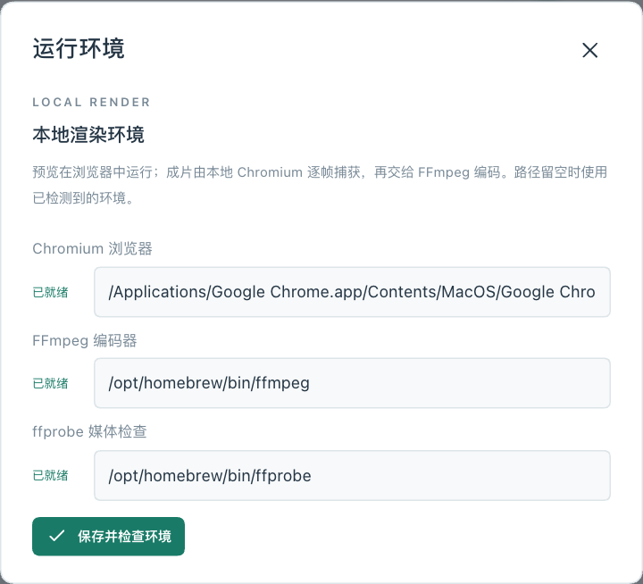
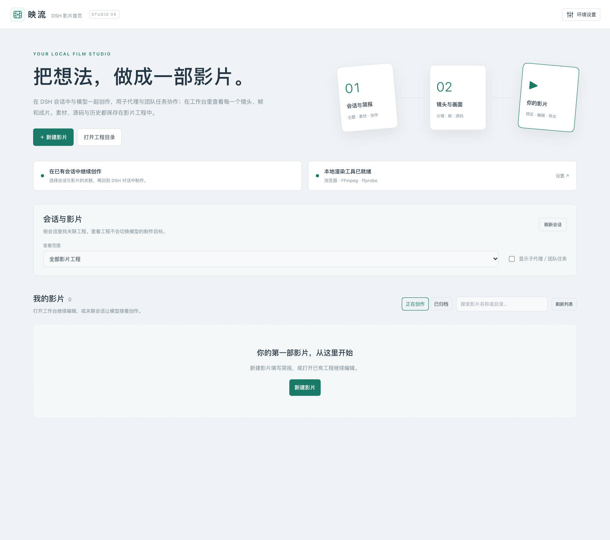
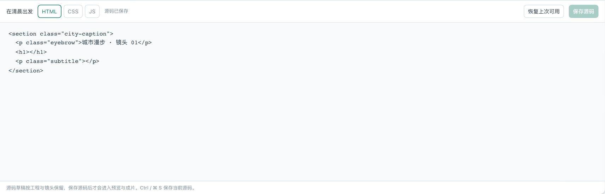
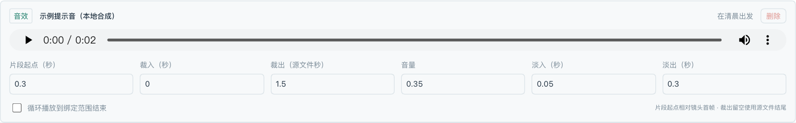
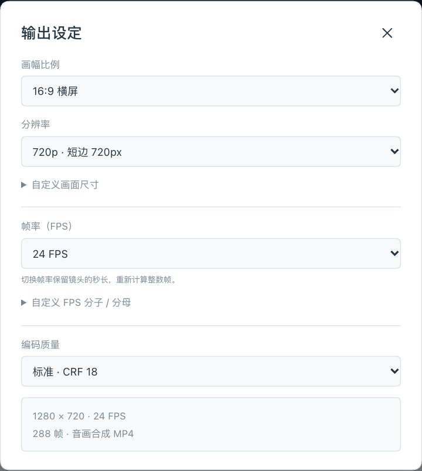
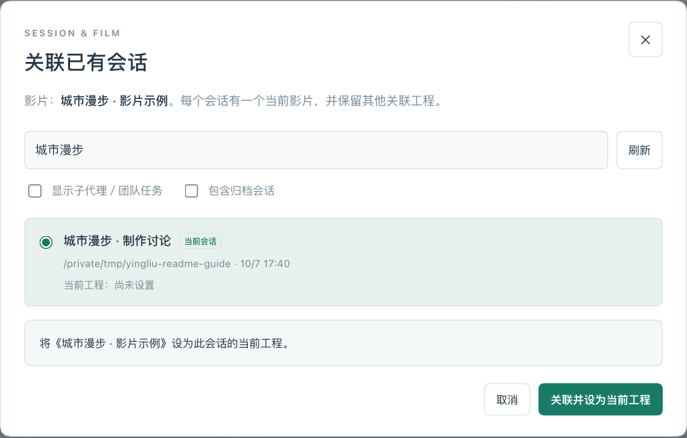

# 映流 · DSH 视频工作台

**在对话中构思影片，在工作台里调整镜头，最后导出本地 MP4。**

映流（`dsh-video-studio`）是 DSH Desktop 的视频制作插件。你可以把图片、文字和音频交给当前会话中的模型，让它编排分镜、编写动画；也可以打开工作台，自己修改文案、安排声音、逐帧检查画面。分镜、素材、前端源码和修改历史都保存在本地工程中，方便继续编辑。

当前版本：**0.4.0**。适配 **DSH 0.2.0-rc.2**，主要在 macOS Desktop 上验证。

[](docs/images/readme/workbench.png)

*工作台中的示例影片。本文截图取自 0.4.0 的独立测试环境，使用专门制作的演示数据，不代表云端模型的生成效果。点击图片可查看大图。*

## 目录

- [可以用它做什么](#features)
- [安装与首次配置](#setup)
- [制作第一部影片](#first-film)
- [在工作台里调整影片](#editing)
- [添加配音、音乐和音效](#audio)
- [检查画面并导出](#export)
- [管理影片和会话](#sessions)
- [保存、备份与恢复](#storage)
- [常见问题](#faq)
- [开发与扩展](#development)

<a id="features"></a>
## 可以用它做什么

| 你想做的事 | 在映流中的做法 |
| --- | --- |
| 用图文制作介绍片、知识讲解或展示视频 | 提供主题和素材，让模型生成分镜与前端动画 |
| 修改某个镜头的文案、色彩或节奏 | 编辑镜头属性，或用一句话说明修改要求 |
| 精细调整动画和布局 | 编辑每个镜头的 HTML、CSS 和 JavaScript |
| 加入旁白、背景音乐和音效 | 导入音频并安排片段，或使用已配置的配音服务 |
| 检查某个瞬间的实际画面 | 播放预览、逐帧定位、查看关键帧，或导出当前帧 PNG |
| 继续制作已有影片 | 从影片首页打开工程，查看历史、恢复修改、再次导出 |

映流通过前端代码绘制画面，使用本机浏览器和 FFmpeg 输出视频。插件已包含节点编辑器与浏览器驱动，**无需安装 ComfyUI**。

目前支持图片、文字和音频输入；暂不支持导入视频剪辑、云端渲染、完整的图层关键帧编辑器或多人实时协作。子代理协作使用 DSH 自身的代理与任务能力，详见[管理影片和会话](#sessions)。

<a id="setup"></a>
## 安装与首次配置

### 1. 准备运行环境

| 需要准备 | 用途 | 什么时候需要 |
| --- | --- | --- |
| DSH Desktop，版本与插件适配要求一致 | 运行插件，提供会话、模型和任务服务 | 始终需要 |
| 本机 Chrome 或 Chromium | 捕获实际画面帧并参与视频渲染 | 实际帧检查和导出时 |
| FFmpeg | 视频编码、音频处理与混音 | 导出或处理声音时 |
| ffprobe | 读取音频与成片信息 | 导入音频、检查媒体时 |
| DSH 中已配置的模型 | 理解需求、生成分镜和画面、按要求改片 | 使用模型创作时 |
| 本机语音或自有语音服务 | 把旁白文字合成为音频 | 需要自动配音时，可选 |

手动编辑已有工程、预览和本地导出不需要调用聊天模型。聊天模型与配音服务分别配置。

尚未安装浏览器时，可以从 [Chrome 官网](https://www.google.com/chrome/)下载。FFmpeg 可从其[下载页面](https://ffmpeg.org/download.html)查找对应系统的构建；macOS 用户如果已安装 Homebrew，也可以按 [FFmpeg 软件包说明](https://formulae.brew.sh/formula/ffmpeg)运行 `brew install ffmpeg`。完成安装后，按下文检查 FFmpeg 和 ffprobe 的路径。

### 2. 安装并启用插件

1. 准备与当前版本对应的安装包，例如 `dsh-video-studio-0.4.0.tgz`。可使用维护者提供的包，或按[开发与扩展](#development)中的步骤自行构建。
2. 打开 DSH 的 **插件管理 → 添加插件**，填写 `.tgz` 文件的绝对路径。
3. 安装完成后启用插件。安装与启用是两个步骤，请确认插件已处于运行状态。
4. 点击 DSH 侧栏的 **映流 · 视频工作台**，进入影片首页。

普通使用不需要克隆源码，也不需要执行后面的开发命令。

### 3. 检查本地渲染工具

在影片首页点击 **环境设置**；进入工作台后，也可以点击右上角的 **环境**。

[](docs/images/readme/environment.png)

*三个工具分别显示「已就绪」或「待配置」。修改路径后，点击「保存并检查环境」。*

插件会尝试自动查找工具。如果显示「待配置」，填写对应**可执行文件**的绝对路径，而不是安装目录。macOS 上常见的路径如下，具体以你的安装位置为准：

| 工具 | 路径示例 |
| --- | --- |
| Google Chrome | `/Applications/Google Chrome.app/Contents/MacOS/Google Chrome` |
| FFmpeg（Apple Silicon 上的 Homebrew） | `/opt/homebrew/bin/ffmpeg` |
| ffprobe（Apple Silicon 上的 Homebrew） | `/opt/homebrew/bin/ffprobe` |

已经安装 FFmpeg 的用户可以在终端运行以下命令查找位置；没有输出通常表示工具未安装，或不在当前终端的搜索路径中。

```sh
command -v ffmpeg
command -v ffprobe
```

点击 **保存并检查环境**，确认三个工具均为「已就绪」。如果修改了本机工具的安装位置，再来这里更新路径即可。

<a id="first-film"></a>
## 制作第一部影片

可以从 DSH 会话开始，也可以直接在工作台中操作。两种方式编辑的是同一份影片工程，制作过程中可以随时切换。

### 方式一：在 DSH 会话中制作

适合已经在对话中整理好主题、文案或素材的情况。

1. 打开一个可以使用视频工具的 DSH 会话，上传需要的图片、文字或音频。
2. 说明影片主题、目标片长、画幅和希望呈现的内容。必须准确出现的人名、产品名与数据，请一并提供。
3. 让模型创建影片工程，先整理分镜，再生成画面。例如：

   > 用我上传的三张街景照片，制作一部约 30 秒的中文城市漫步短片。横屏 16:9，1920 × 1080，30 FPS。分为开场、街巷细节和收尾三个部分，文字简洁，图片缓慢移动。先创建工程并整理分镜，再生成画面。保留可编辑的文字、颜色和图片参数，导出前检查实际帧。这次先做无声版。

4. 从视频工具的结果卡片打开工作台，查看对应影片、镜头或指定帧。
5. 需要修改时，可以继续在原会话中描述范围：

   > 只修改第二个镜头：把屏幕主文字改为“慢一点，看见街角的日常”，图片改为缓慢放大。保留其他镜头和声音，修改后检查这个镜头的首帧、中间帧和末帧。

6. 确认内容后，让模型导出，或在工作台点击 **导出视频**。

会话中的制作直接使用当前会话模型。耗时的渲染或配音任务交给 DSH 后台任务处理；可以让模型查询进度或取消。普通使用无需手写工具参数，开发者可查阅 [API 文档](docs/API.md)。

### 方式二：从工作台开始

[](docs/images/readme/home.png)

*首页集中管理影片。可以先建立工程、导入素材，再选择模型生成分镜。*

1. 点击 **新建影片**，填写「影片名称」「主题与制作想法」「初始目标片长（秒）」和「初始输出比例」。会话关联可以先留空。
2. 点击 **创建影片** 进入工作台。初始输出默认为所选比例、短边 1080 像素、30 FPS，之后可以修改。
3. 在左侧 **资产库** 点击 **导入素材** 或 **添加文字**。支持的格式见下表。
4. 在顶部 **创作模型** 中选择 DSH 已配置的提供方和具体模型。如果没有可选模型，先到 DSH 中完成模型配置。
5. 点击 **生成分镜**，检查每个镜头的内容、素材和时长，再点击 **生成画面**，让模型编写镜头动画。
6. 点击 **预览**，根据画面继续调整。需要声音时，按[配音说明](#audio)添加；完成后[检查并导出](#export)。

| 素材类型 | 支持格式 | 添加方式 |
| --- | --- | --- |
| 图片 | PNG、JPEG、WebP | 导入素材，或把图片拖入资产库 |
| 文字 | TXT、Markdown，也可直接粘贴 | 导入素材，或点击「添加文字」 |
| 音频 | WAV、MP3、M4A、AAC、FLAC、OGG | 导入素材，然后在「声音与配音」中安排片段 |

**「生成分镜」和「生成画面」是两个步骤。** 如果已选好模型，新建时的「创建并生成分镜」可以合并创建与分镜步骤，之后仍需要生成画面。也可以自行添加镜头、修改默认画面，再直接预览。

**再次点击「生成分镜」会重新编排整套镜头，并为新镜头建立默认源码。** 已有影片只需局部改动时，请使用镜头属性或「修改这个镜头」。

<a id="editing"></a>
## 在工作台里调整影片

### 认识几个主要区域

| 区域 | 用来做什么 |
| --- | --- |
| 顶部工具栏 | 选择创作模型，设置输出规格，生成、预览和导出 |
| 左侧「资产库」 | 导入、搜索和查看图片、文字、音频 |
| 中间「分镜画布」 | 查看素材与镜头的关系，连接播放顺序 |
| 右侧「镜头属性」 | 修改选中镜头的文字、时长、颜色、运动和图片位置 |
| 画布下方「镜头顺序」 | 选择镜头、拖动排序，快速查看整片结构 |
| 下方工作面板 | 切换影片预览、声音、制作要求、源码、历史、任务和成片 |

### 调整内容和顺序

- **修改画面文字**：选中镜头，在右侧修改「屏幕主文字」和「补充文字」。镜头标题用于标识镜头，与画面中显示的文字分别编辑。
- **调整时长**：修改「时长（秒）」。实际片长等于所有镜头时长之和；「目标片长」用于初始规划，之后增删镜头不会强行缩放其他镜头。
- **更换素材**：在「素材关联」中选择「使用」或「参考」。「使用」让素材参与画面；「参考」帮助模型理解风格与构图，不会自动显示在成片里。仅把素材导入资产库，还没有把它安排进镜头。
- **改变图片构图**：展开「图片位置与缩放」，调整横向位置、纵向位置、缩放和适应方式。
- **调整顺序**：拖动镜头条，或连接画布上的镜头顺序端口。若提示「主链待连接」，检查是否有断链、分叉或循环，也可以点击「按镜头条连接」。
- **整理画布**：拖动空白处平移，滚轮缩放；用「全图概览」「聚焦选中」和「整理画布」找回节点。

画布上的节点位置只影响工作区布局。视频中的图片位置要在镜头属性中调整。参数修改后，如果预览提示内容已更新，点击 **刷新预览** 查看效果。

### 用自然语言改片

在 **影片预览** 右侧选择「当前镜头」或「整部影片」，输入要求，然后点击 **修改这个镜头** 或 **修改整部影片**。

可以写：“标题从左侧滑入，图片缓慢放大，背景改成奶油色，保持当前时长。”描述中同时说明希望保留的内容，通常更容易得到所需结果。

### 直接编辑源码

选中镜头，打开 **前端源码**，切换 HTML、CSS、JS 进行编辑。点击 **保存源码**，或使用 `Ctrl / ⌘ S`，再刷新预览检查结果；出现问题时可以 **恢复上次可用**。

[](docs/images/readme/source.png)

*每个镜头有独立源码。先保存，再刷新预览，就能检查这次修改。*

源码草稿会按工程和镜头保留。**草稿尚未提交时，不会进入预览或成片，还会阻止预览、导出等操作。** 可以从顶部「查看源码草稿」进入，保存或丢弃后继续；也可下载草稿备份。如果模型已更新工程，请先对照最新源码，再决定是否将草稿保存到当前版本。

自定义源码需要读取 `ctx.params` 中的共享参数，右侧属性才能控制对应内容。写死在源码里的文字或颜色，需要修改源码或让模型修改。源码不会自动还原成可视图层。场景接口和示例见 [API 文档](docs/API.md)。

<a id="audio"></a>
## 添加配音、音乐和音效

[](docs/images/readme/audio.png)

*导入音频后，需要把它添加为声音片段，才会进入影片。自动生成的镜头配音会直接添加到对应镜头。*

### 使用已有音频

1. 在 **资产库 → 导入素材** 中选择音频文件。
2. 打开 **声音与配音**，选择「音频资产」和「用途」：配音、背景音乐或音效。
3. 选择「绑定范围」。旁白通常绑定具体镜头，背景音乐通常绑定整部影片。
4. 点击 **添加声音片段**，设置时间和音量。需要时勾选循环播放。
5. 确认 **预览和导出包含声音** 已勾选，切回 **影片预览**，点击 **刷新预览** 后播放试听。

| 参数 | 如何理解 |
| --- | --- |
| 片段起点（秒） | 绑定镜头时，相对该镜头开头计算；绑定全片时，相对影片开头计算 |
| 裁入（秒） | 从源音频的哪个位置开始使用 |
| 裁出（源文件秒） | 使用到源音频的哪个位置；留空使用到文件结尾 |
| 音量 | `1` 为原音量，`0.25` 为原音量的四分之一；可以先降低背景音乐，再试听旁白是否清楚 |
| 淡入、淡出（秒） | 声音渐强、渐弱的持续时间 |

例如，把一段音频绑定第二个镜头，起点设为 `1`，裁入设为 `2`、裁出设为 `6`，就会在第二个镜头开始 1 秒后，播放源文件第 2～6 秒的内容。

### 根据文字生成配音

配音服务的入口是 **声音与配音 → 配音模型设置**。

**使用 macOS 本机语音：**

1. 语音端点填写 `local:say`，勾选「启用」。
2. 「声音」填写本机已安装的系统声音名称，例如已安装时可用的 `Tingting`；留空使用系统默认。无需填写配音模型或 API Key。
3. 设置语速，点击 **保存配音配置**。
4. 选中镜头，填写「镜头旁白」，点击 **生成镜头配音**。

**使用自有语音服务：**

在同一面板填写兼容语音接口的完整地址，例如 `https://your-service.example/v1/audio/speech`，并填写服务要求的模型 ID、声音 ID、语速和语音 API Key。勾选「启用」后保存配置，再生成镜头配音。地址、模型和声音 ID 以该服务的实际要求为准。

语音 Key 使用 DSH 凭据服务保存，不写入影片工程，也不自动复用聊天模型的 Key。**输入框留空会保留原 Key；点击「清除密钥」才会删除。** 本机语音不调用外部 API；使用远程服务时，旁白文本会提交给你填写的端点。

默认不启用自动配音。远程兼容接口是否可用、支持哪些声音，需要按所用服务确认。

### 旁白比镜头长时怎么办

默认情况下，较长的镜头旁白会在必要时延长对应镜头。如果必须保持原有片长，勾选 **锁定镜头时长**；超长时会提示差额，你可以缩短旁白、调整裁剪，或解除锁定。

绑定整部影片的旁白不会自动决定延长哪个镜头；如果超出全片时长，会提示错误，需要先延长镜头或裁剪音频。重新生成同一镜头的配音会替换其原配音片段，旧音频素材仍保留在资产库中。

<a id="export"></a>
## 检查画面并导出

### 1. 设置画幅、分辨率和帧率

点击工作台顶部显示比例、尺寸和 FPS 的规格按钮，打开 **输出设定**。

[](docs/images/readme/export.png)

*示例工程使用 16:9、1280 × 720、24 FPS；请根据实际用途选择规格。*

| 设置 | 可选内容 |
| --- | --- |
| 画幅比例 | 16:9、9:16、1:1、4:5、4:3、3:4、21:9、16:10，或自定义宽高 |
| 分辨率 | 短边 480、720、1080、1440、2160 像素，或自定义尺寸 |
| 帧率 | 24、25、30、50、60 FPS，以及 24000/1001、30000/1001、60000/1001 或自定义分数帧率 |
| 编码质量 | 标准（CRF 18）、高质量（CRF 16）、更小文件（CRF 23） |

分辨率按**短边**计算。例如，16:9 的 1080p 是 **1920 × 1080**，9:16 是 **1080 × 1920**，4:5 是 **1080 × 1350**。以面板中显示的实际像素尺寸为准。切换帧率会保留镜头的秒数，并重新计算整数帧。

### 2. 检查实际预览

点击 **预览** 或 **刷新预览**。预览运行项目中的实际 HTML、CSS、JavaScript 和素材。

- 播放全片，检查顺序、节奏、文字和声音。
- 使用「上一帧」「下一帧」，或输入全片帧号后点击「定位」。帧号从 `0` 开始。
- 选择镜头，查看首帧、中间帧和末帧等关键画面；需要时打开「大预览」。
- 点击 **导出当前帧 PNG**，保存某一帧供检查或交流。

导出前建议确认：素材已正确绑定，文字没有被裁切，旁白没有超出画面，声音开关和输出尺寸符合要求。

### 3. 导出并找到成片

1. 点击 **导出视频**。
2. 在 **任务记录** 查看进度。执行中的任务可以取消；失败时先查看错误信息和日志，处理后再重试。
3. 完成后打开 **历史成片**，点击 **播放成片** 或 **打开文件 ↗**。这里同时显示导出时的工程版本、尺寸、时长和文件位置。

输出格式为 **H.264 MP4**。启用声音且有可混合的音频片段时，音轨使用 **AAC、48 kHz、双声道**。成片保存在工程的 `exports/<导出 ID>/` 目录中。

每次导出使用启动时已保存的工程版本。导出开始后继续编辑，不会改变正在导出的内容；旧成片也会保留。如果想导出刚完成的修改，需要启动一次新的导出。

<a id="sessions"></a>
## 管理影片和会话

### 找回和整理影片

在首页的 **我的影片** 中，可以按名称或目录搜索，打开工作台继续编辑。卡片的管理菜单提供「重命名」「复制工程」「归档」，已归档工程可在 **已归档** 中恢复。

- **复制工程**：生成独立工程，包含当前镜头、源码和素材；不继承会话关联、原修改历史或历史成片。
- **归档**：保留原工程目录，从正在创作的列表中移出；需要时可以恢复。
- **打开工程目录**：输入已有工程目录的绝对路径，即包含 `project.json` 的文件夹。

### 关联已有会话

[](docs/images/readme/session.png)

*一个会话可以关联多部影片，但同一时间只有一部「当前工程」。界面会说明本次关联是否切换当前工程。*

1. 在影片卡片或工作台点击 **关联会话**。
2. 按会话名称或工作区搜索，选择希望继续制作的会话。
3. 查看原当前影片和目标影片，确认后建立关联。之后通过 **继续会话** 返回对话。

一个影片也可以关联多个会话。模型调用视频工具时，如果没有明确指定工程，就使用该会话的当前工程。

**浏览影片和切换当前工程是不同操作。** 在首页筛选影片、打开工作台，都不会改变模型的制作目标。切换到另一部影片时，使用明确的关联操作，或界面提供的 **设为当前工程并进入会话**。

解除关联只移除指定会话与影片的关系，保留工程和聊天记录。解除当前工程后，不会自动选中另一部影片。若会话或使用其工程的子代理正在执行，请等当前回合结束后再切换。已经启动的导出仍使用原工程版本。

### 子代理与团队任务

会话选择器默认显示普通会话；勾选 **显示子代理／团队任务** 后，可查看宿主发现的相关任务。

能够使用视频工具的子代理和团队成员，默认沿委派关系使用最近上级的当前工程。需要单独制作时，可以给某个成员建立专属关联；普通分叉会话不会自动继承影片。插件使用 DSH 已有的代理与任务服务，不负责创建团队或为代理额外安装工具。

多个成员编辑同一影片时，适合按镜头、声音或检查任务分工。开发者应在写入前读取最新 `revision`，并提交 `expectedRevision`，避免覆盖其他成员的修改。关联规则、继承行为和工具示例见[会话与代理制作说明](docs/SESSION-WORKFLOW.md)。

<a id="storage"></a>
## 保存、备份与恢复

参数、素材关联、音轨和画布修改会自动保存，离开前请确认顶部显示 **已保存**。源码编辑需要单独点击 **保存源码**。已保存的工程在重启 DSH 后仍可继续使用。

新工程默认保存在 `~/Documents/DSHVideoProjects`。自定义存放位置可通过插件组合包的 `baseDirectory` 配置；当前环境面板只配置渲染工具路径。

```text
影片工程/
├── project.json       # 工程信息、分镜、参数、文字素材和媒体引用
├── assets/            # 图片和音频文件
├── shots/             # 各镜头的前端源码
├── .studio/           # 完整版本、修改历史和任务状态，备份时需要保留
├── runtime/           # 插件生成的运行页面、混音等文件
└── exports/           # 每次导出的成片、输入快照和检查结果
```

**备份或搬运时，请复制整个工程目录，包括隐藏的 `.studio/`。** 在新位置通过「打开工程目录」继续使用。已保存源码可以随工程搬运；尚未提交的源码草稿保存在 DSH 客户端本地存储中，应先保存或下载备份。

「修改历史」中的撤销和重做在重开工程后仍然有效，恢复旧内容会产生新的工程版本。「任务记录」会保留完成、失败、取消和中断状态；支持重试的任务会显示 **以当前工程重试**。重试使用当前已保存内容，并不接着旧任务的逐帧进度继续。配音需要明确重新生成。

会话关系另存于当前工程基目录的 `sessions.json`，只对对应的 DSH 安装有意义。搬运工程不会自动恢复另一台机器上的会话关系。旧版图文或无声工程可以打开，首次打开时会补建所需的版本记录。

如需修改镜头代码，优先使用「前端源码」面板。直接改写工程目录中的源码文件不会自动替换插件保存的完整版本。

<a id="faq"></a>
## 常见问题

| 遇到的情况 | 可以怎样处理 |
| --- | --- |
| 安装后找不到入口 | 在插件管理中确认已经启用并处于运行状态，再查找侧栏「映流 · 视频工作台」；同时核对 DSH 与插件版本 |
| 无法选择创作模型 | 先在 DSH 配置模型提供方与模型，再回工作台选择；会话内制作使用的是该会话的模型 |
| 「创建并生成分镜」不可用 | 先用「创建影片」进入工作台，选择创作模型，再点击「生成分镜」；主题不能为空 |
| 已生成分镜，但画面仍很基础 | 检查并调整分镜后，继续点击「生成画面」；分镜生成不会自动完成全部动画 |
| 图片或文字导入失败 | 检查格式和文件大小：单张图片上限为 20 MB，单份文字上限为 2 MB；视频暂不支持导入 |
| 素材已导入，却没出现在画面中 | 选中镜头，在「素材关联」里设为「使用」；只导入或设为「参考」不会自动出现在画面中。自定义源码也需要读取该素材 |
| 改了文字、颜色或图片位置，预览没有变化 | 先点「刷新预览」；如仍无变化，检查自定义源码是否读取了对应的 `ctx.params` 参数 |
| 提示主链待连接，无法生成画面或导出 | 检查镜头顺序是否断开、分叉或循环；确认镜头条顺序后，可点「按镜头条连接」 |
| 提示有源码草稿，不能预览或导出 | 点「查看源码草稿」，保存或丢弃尚未提交的草稿后继续 |
| 显示保存冲突或 `REVISION_CONFLICT` | 工程已被其他操作更新。如有未保存参数，先点击「保存本地参数副本」，再按提示重新读取最新工程，对照副本补回需要的改动；源码草稿会保留 |
| 实际帧检查或导出提示找不到工具 | 到「环境」检查 Chromium、FFmpeg、ffprobe；填写可执行文件的绝对路径，再点「保存并检查环境」 |
| 导入音频后，预览和成片没有声音 | 在「声音与配音」中添加声音片段，检查音量与「预览和导出包含声音」，再刷新预览 |
| 「生成镜头配音」不可用 | 先选中镜头并填写旁白，再在「配音模型设置」启用服务并保存配置 |
| 本机配音找不到声音 | 将「声音」留空使用系统默认，或改填本机已安装的声音名称 |
| 旁白超出镜头，或总片长变长 | 检查「锁定镜头时长」。可缩短旁白、裁剪音频或手动延长画面；未锁定时，镜头旁白可自动延长镜头 |
| 重启后任务显示已中断 | 已保存工程仍可使用。处理原问题后，点击「以当前工程重试」；需要配音时重新生成 |
| 当前打开的影片与模型修改的影片不同 | 打开工作台只影响浏览。检查会话的「当前工程」，通过关联操作切换，或在会话中明确指定影片 |
| 成片无法在插件内播放 | 先用「打开文件 ↗」检查文件；若文件本身也异常，查看任务错误和日志，再重新导出 |

<a id="development"></a>
## 开发与扩展

以下命令在 **`dsh-video-studio` 插件目录**中执行，面向需要构建、调试或扩展插件的开发者。按当前锁文件的依赖要求，使用 Node.js **22.18+（22.x）或 24.11+**。

先安装锁文件中的开发依赖：

```sh
npm ci --legacy-peer-deps --ignore-scripts
```

本地测试还需要能解析 `package.json` 中的 DSH peer dependencies。上面的命令会跳过自动安装 peer dependencies，请在 DSH 插件开发环境中安装或链接对应依赖，版本与宿主保持一致。运行插件时这些依赖由 DSH 提供；单独在终端测试时，也需要它们在本项目中可用。

依赖准备好后，执行检查、构建和打包：

```sh
npm run typecheck
npm test
npm run build
mkdir -p artifacts
npm pack --pack-destination artifacts
```

`scripts/prepare-local.mjs` 供维护者复用已有本地依赖。使用前需要通过 `DSH_REFERENCE_PLUGIN` 指向已备妥依赖的参考插件目录，并准备该脚本要求的 `.local/runtime/node_modules`、父仓库中的 Playwright，以及本插件的 `.local/vendor/comfyorg-litegraph-0.17.2.tgz`。首次配置时请先核对脚本中的路径；发行锁文件不包含这些本机路径。

`npm run preview` 使用官方 DSH 运行库和独立 profile，默认端口为 `19405`。默认 CLI 路径为 `/Applications/DeepSeek Harness.app/Contents/Resources/runtime/cli/bin/dsh`，其他安装位置可通过 `DSH_CLI` 指定。预览脚本中的固定响应模型用于本地测试，不随插件发布；它不能用于判断真实模型的生成质量。

| 文档 | 内容 |
| --- | --- |
| [API 与场景接口](docs/API.md) | 工程结构、视频工具、音轨、`ctx` 参数和源码渲染约定 |
| [会话与代理制作说明](docs/SESSION-WORKFLOW.md) | 多影片关联、子代理继承、团队协作和版本冲突处理 |
| [0.4 验收说明](docs/ACCEPTANCE-v0.4.md) | 检查范围、复现方式与验收结果的适用范围 |
| [配图来源](docs/images/readme/SOURCES.md) | 截图环境、演示素材和各张图片的内容 |
| [项目来源](docs/ORIGIN.md) | 插件与相关项目的关系 |
| [第三方声明](THIRD_PARTY_NOTICES.md) | 使用的开源组件和许可来源 |
| [MIT 许可证](LICENSE) | 本项目的使用许可 |

本地验收记录保存在 `artifacts/verification/`，按版本分目录。检查记录分别说明固定响应模型测试、真实本地媒体、原生界面、远程服务和人工观看的完成情况。README 配图来自独立演示环境，截图与功能说明不能代替特定云端模型或语音服务的实际验证。
